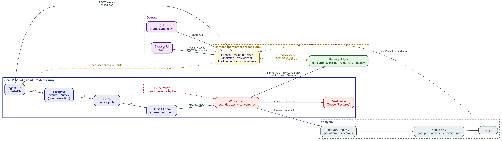
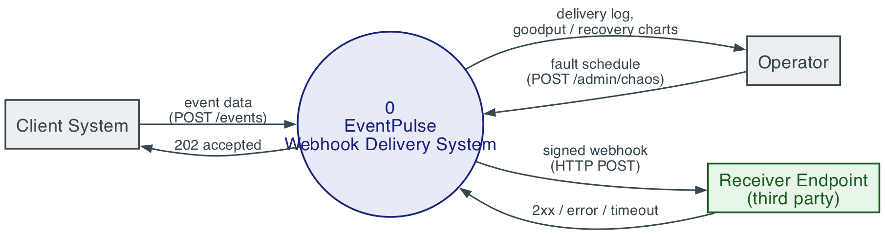
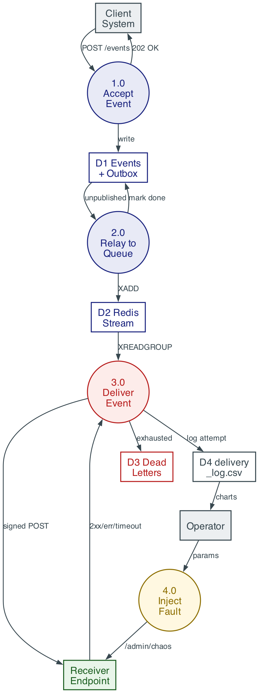
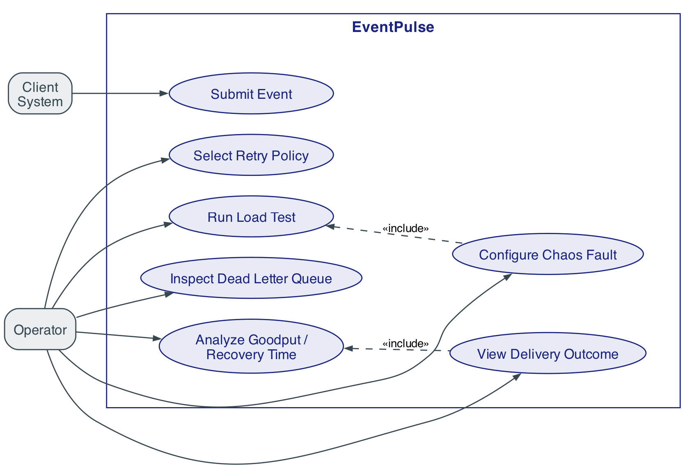
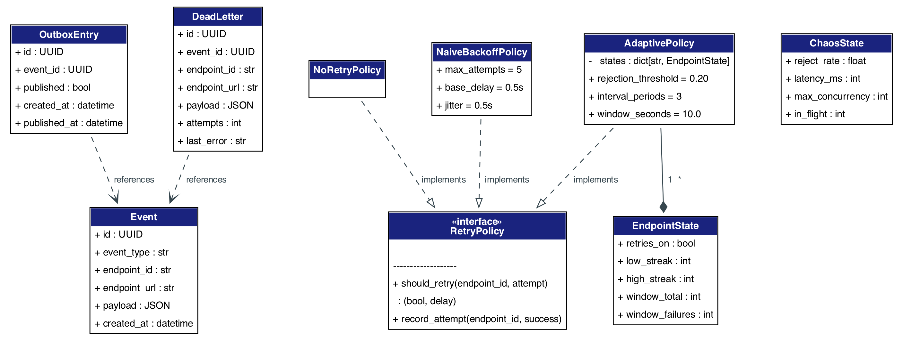
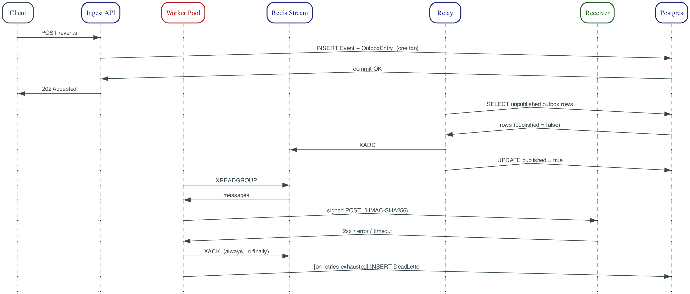
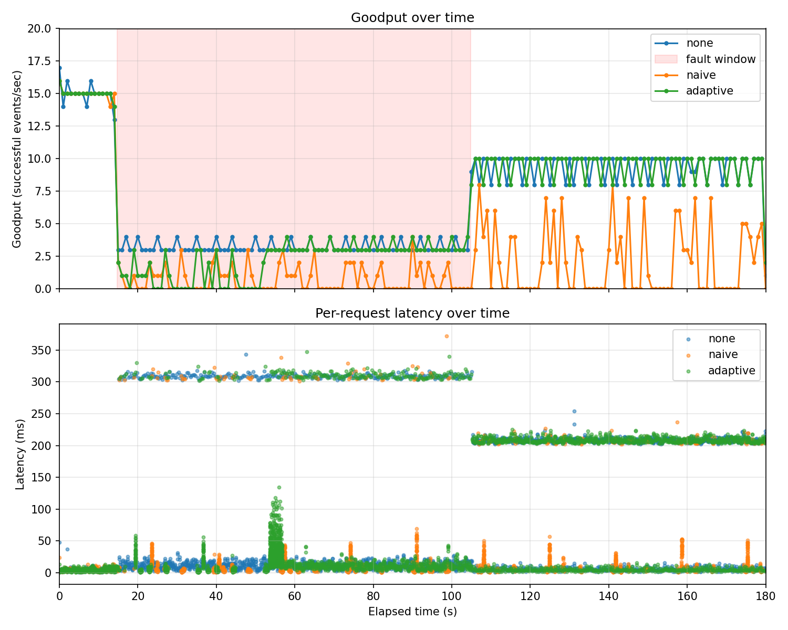

# EventPulse

[](https://github.com/divyaraj24/EventPulse/actions/workflows/ci.yml)
[](LICENSE)

A reliable webhook delivery system with failure analytics. It's a durable, at-least-once delivery pipeline that gets deliberately subjected to controlled chaos, so we can measure exactly when automatic retry stops helping and starts sustaining the outage it was supposed to fix.

Webhooks depend on third-party receivers that time out or fail intermittently, and the usual fix, automatic retry, is itself destabilizing. Retry traffic amplifies load on an already-degraded receiver and can keep the delivery tier stuck in a self-sustaining overloaded state long after the original fault has cleared. This pattern is documented in the distributed-systems literature as a **metastable failure** (Bronson et al., HotOS '21). EventPulse builds a real delivery pipeline and then benchmarks a naive fixed-backoff retry policy against a metastability-aware adaptive policy, under identical, reproducible fault injection.

## Architecture



Five containerized services on an internal Docker network, plus two host-side scripts that drive experiments:

- **Ingest API**: accepts `POST /events`, writes the event and an outbox row in a single Postgres transaction (the transactional outbox pattern), and returns `202 Accepted`. That single-transaction write is what guarantees an accepted event is never silently lost, regardless of what happens downstream.
- **Relay**: polls the outbox for unpublished rows and publishes them to a Redis Stream, marking each row published once it succeeds.
- **Worker pool**: consumes the stream through a consumer group, signs each payload with HMAC-SHA256, delivers over HTTP under a bounded concurrency limit, and applies whichever retry policy is active.
- **Mock receiver**: a controllable stand-in for a third-party endpoint. It exposes admin endpoints so we can set a concurrency ceiling, a random rejection rate, and injected latency at runtime.
- **Postgres and Redis**: durable storage for events/outbox/dead-letters, and the delivery work queue.
- **Load generator and chaos harness** (run on the host, not in Docker): generate paced offered load and drive the receiver through a steady/fault/recovery timeline.

```
Ingest API → Transactional Outbox → Relay → Redis Stream → Worker Pool (Retry Policy) → Signed HTTP Delivery → Receiver
```

Every service except the worker doesn't care which retry policy is active. Switching between `none`, `naive`, and `adaptive` only changes the worker's configuration, so the fault applies identically no matter which condition is running.

<details>
<summary>Additional diagrams (DFD, use case, class, sequence)</summary>

| | |
|---|---|
|  |  |
|  |  |
|  | |

</details>

## Retry policies

All three implement the same two-method interface (`worker/retry_policies.py`), so the worker calls them identically no matter which one is active:

| Policy | Behavior |
|---|---|
| `none` | One failed attempt goes straight to dead-letter. This is the experimental baseline: it isolates whether retrying itself is what amplifies load, independent of any backoff strategy. |
| `naive` | Bounded exponential backoff with jitter, capped at 5 attempts. It's stateless: the delay only depends on how many times *this* message has been attempted, with no memory of how the endpoint is behaving overall. |
| `adaptive` | A per-endpoint failure-rate gate based on [RetryGuard](docs/references/09_tavori_retryguard_arXiv2511.23278.pdf) (Tavori et al., 2025). Retries get disabled once an endpoint's failure rate stays above 20% for 3 consecutive 10-second measurement windows, and re-enabled once the same streak drops back below it. When the gate is open, it reuses naive's backoff timing, so the gate itself is the only thing that differs between the two conditions. |

## Results

**Headline finding, from the project report** (`docs/EventPulse_Review2_Draft.docx`). Same offered load (15 events/s, 120s) and the same fault (40s at concurrency ceiling 1 plus 300ms latency) across all three conditions; only the retry policy differs:

| Condition | Recovery time after fault clears | Unresolved events (of 1800) |
|---|---|---|
| `none` | instant (never builds a backlog) | 0, but it discards 26% of events outright |
| `naive` | doesn't recover within the observed window | 684 (38%) still circulating when the run ends |
| `adaptive` | 6.0s | 0 |

Extending the naive run to 300 seconds of continuous load doesn't show a slow recovery, it shows goodput holding flat around 3 events/s (against a 15 events/s baseline), with 67% of events still unresolved by the time the run stops. That's a chronic degraded equilibrium, not a slow drain. One thing worth noting: per-request latency stays low (0-50ms) the whole time. The receiver is being overwhelmed by retry volume, not slow processing, so watching latency alone would never have caught this.

**Reproducible in this repository.** A harsher variant (`scripts/results/*_hardfault_*`, committed here), a 90-second fault with deliberately throttled recovery capacity, one run per policy:



| Condition | Delivered | Dead-lettered | Retries fired | Still unresolved (of 2700) |
|---|---|---|---|---|
| `none` | 1224 (45%) | 1476 (55%) | 0 | 0 |
| `naive` | 815 (30%) | 423 (16%) | 3231 | **1420** |
| `adaptive` | 1134 (42%) | 1566 (58%) | 366 | 0 |

Naive is the only policy that doesn't even finish processing the offered load. Its retry storm piles messages up faster than the throttled receiver can drain them. Both `none` and `adaptive` fully resolve every event, and adaptive does it while still retrying productively wherever it's actually safe to.

### Limitations (from the project report)

- Results so far are single runs per condition, so run-to-run variance isn't quantified yet.
- Only one receiver endpoint is exercised. Adaptive tracks state per endpoint, but its behavior across many endpoints of differing health hasn't been tested.
- The fault tested is a capacity ceiling combined with injected latency. Other shapes, like high random rejection rates or partial outages, aren't covered by the benchmark yet.
- "Doesn't recover" is bounded by the longest window tested (about 360 seconds post-fault). That's a statement about the trend staying flat within that window, not proof it would never recover.

## Running it

```bash
docker compose up --build -d --wait   # bring the full pipeline up
docker compose down -v                # tear down
```

Run a full experiment (rebuild, load and fault injection in parallel, wait for drain, extract logs, chart):

```bash
cd scripts
./run_experiment.sh naive_test --policy naive -- --max-concurrency 1 --reject-rate 0.3
```

Check `scripts/run_experiment.sh`'s header comment for the full set of flags, including the newer surge-driven fault mode (`--surge-rate`, `--poisson`, `--repeats`). That mode triggers overload with a genuine offered-rate surge against the receiver's fixed real capacity, instead of an admin endpoint switching synthetic errors on and off.

## Tech stack

Python 3.12, FastAPI, SQLAlchemy 2.0, PostgreSQL 18, Redis 7 (Streams), httpx (async), Docker Compose.

## References

The full literature review and reference list live in `docs/EventPulse_Review2_Draft.docx`. Source PDFs for the three papers used most directly are in `docs/references/`. The adaptive policy is a direct, simplified port of RetryGuard's productive-retry controller (Tavori, Bremler-Barr, Levy & Lavi, 2025).

## License

MIT, see [LICENSE](LICENSE).
