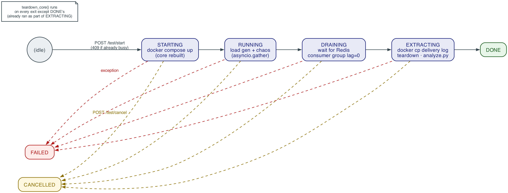
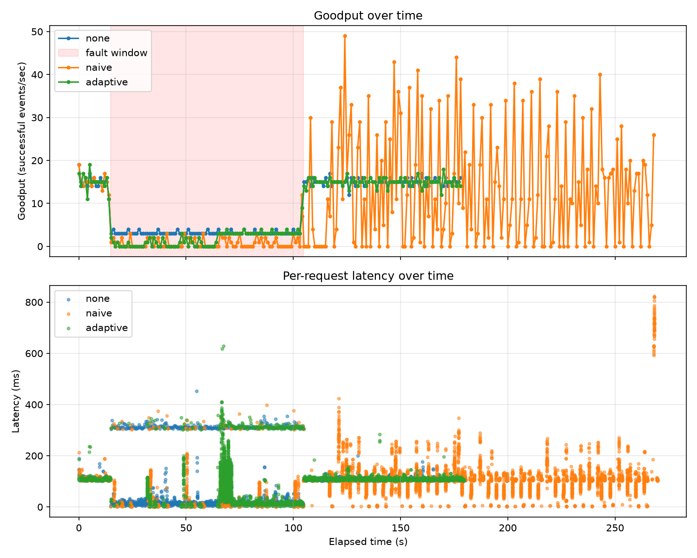

# EventPulse

[](https://dl.circleci.com/status-badge/redirect/circleci/6uVYqMakkoyjmqM1huUNSW/FU7aux9tfv5qfgY62LR2PR/tree/main)
[](api/Dockerfile)
[](docker-compose.core.yml)
[](LICENSE)

A reliable webhook delivery system with failure analytics. It's a durable, at-least-once delivery pipeline that gets deliberately subjected to controlled chaos, so we can measure exactly when automatic retry stops helping and starts sustaining the outage it was supposed to fix.

Webhooks depend on third-party receivers that time out or fail intermittently, and the usual fix, automatic retry, is itself destabilizing. Retry traffic amplifies load on an already-degraded receiver and can keep the delivery tier stuck in a self-sustaining overloaded state long after the original fault has cleared. This pattern is documented in the distributed-systems literature as a **metastable failure** (Bronson et al., HotOS '21). EventPulse builds a real delivery pipeline and then benchmarks a naive fixed-backoff retry policy against a metastability-aware adaptive policy, under identical, reproducible fault injection.

## Architecture


The repo splits into the **core product** (the delivery pipeline actually being tested) and the **harness** (test infrastructure that drives it), so the two are never confused with each other:

Core product (`docker-compose.core.yml`, rebuilt fresh for every test run):
- **Ingest API**: accepts `POST /events`, writes the event and an outbox row in a single Postgres transaction (the transactional outbox pattern), and returns `202 Accepted`. That single-transaction write is what guarantees an accepted event is never silently lost, regardless of what happens downstream.
- **Relay**: polls the outbox for unpublished rows and publishes them to a Redis Stream, marking each row published once it succeeds.
- **Worker pool**: consumes the stream through a consumer group, signs each payload with HMAC-SHA256, delivers over HTTP under a bounded concurrency limit, and applies whichever retry policy is active.
- **Postgres and Redis**: durable storage for events/outbox/dead-letters, and the delivery work queue.

Harness (`harness/docker-compose.yml`, persistent across runs):
- **Mock receiver**: a controllable stand-in for a third-party endpoint. It exposes admin endpoints so the harness can set a concurrency ceiling, a random rejection rate, and injected latency at runtime.
- **Harness service**: a FastAPI service that owns the whole experiment lifecycle — rebuilding the core stack with the requested retry policy, generating paced offered load, driving the receiver through a steady/fault/recovery timeline, draining the queue, extracting results, and charting them. It also serves a small browser frontend (`frontend/`, at `/ui`) so a full run can be configured and watched without touching a terminal; `harness/main.py` is the equivalent CLI client for scripted/manual runs.

```
Ingest API → Transactional Outbox → Relay → Redis Stream → Worker Pool (Retry Policy) → Signed HTTP Delivery → Receiver
```

A run is single-flight (one at a time, `409` if another is already going) and moves through a fixed sequence of states, torn down cleanly on both failure and cancellation:



Every service except the worker doesn't care which retry policy is active. Switching between `none`, `naive`, and `adaptive` only changes the worker's configuration, so the fault applies identically no matter which condition is running.

<details>
<summary>Additional diagrams (DFD, use case, class, sequence)</summary>

| | |
|---|---|
|  |  |
|  |  |
|  | |

</details>

## Retry policies

All three implement the same two-method interface (`worker/retry_policies.py`), so the worker calls them identically no matter which one is active:

| Policy | Behavior |
|---|---|
| `none` | One failed attempt goes straight to dead-letter. This is the experimental baseline: it isolates whether retrying itself is what amplifies load, independent of any backoff strategy. |
| `naive` | Bounded exponential backoff with jitter, capped at 5 attempts. It's stateless: the delay only depends on how many times *this* message has been attempted, with no memory of how the endpoint is behaving overall. |
| `adaptive` | A per-endpoint failure-rate gate based on [RetryGuard](https://arxiv.org/abs/2511.23278) (Tavori et al., 2025). Retries get disabled once an endpoint's failure rate stays above 20% for 3 consecutive 10-second measurement windows, and re-enabled once the same streak drops back below it. When the gate is open, it reuses naive's backoff timing, so the gate itself is the only thing that differs between the two conditions. |

## Results

All numbers below are reproducible, not pre-committed data to take on faith. Clone the repo and run each condition yourself:

```bash
docker compose -f harness/docker-compose.yml up -d --build --wait
for policy in none naive adaptive; do
  python3 harness/main.py ${policy}_hardfault --policy "$policy" --rate 15 --duration 180 \
    --chaos --steady 15 --fault 90 --recovery 60 --max-concurrency 1 --latency-ms 300 \
    --recovered-max-concurrency 2 --recovered-latency-ms 200
done
```

Same offered load and the same 90-second fault (deliberately throttled recovery capacity) across all three conditions; only the retry policy differs:



| Condition | Delivered | Dead-lettered | Retries fired | Still unresolved (of 2700) |
|---|---|---|---|---|
| `none` | 1224 (45%) | 1476 (55%) | 0 | 0 |
| `naive` | 815 (30%) | 423 (16%) | 3231 | **1420** |
| `adaptive` | 1134 (42%) | 1566 (58%) | 366 | 0 |

Naive is the only policy that doesn't even finish processing the offered load. Its retry storm piles messages up faster than the throttled receiver can drain them, leaving over half of everything sent stuck mid-retry when the run ends. Both `none` and `adaptive` fully resolve every event, and adaptive does it while still retrying productively wherever it's actually safe to.

### Limitations

- Results so far are single runs per condition, so run-to-run variance isn't quantified yet.
- Only one receiver endpoint is exercised. Adaptive tracks state per endpoint, but its behavior across many endpoints of differing health hasn't been tested.
- The fault tested here is a capacity ceiling combined with injected latency. Other shapes, like high random rejection rates or partial outages, aren't covered by the benchmark yet.

## Running it

Bring up the harness (persistent across runs, controls everything else — the core product is rebuilt fresh per run, not started here):

```bash
docker compose -f harness/docker-compose.yml up -d --build --wait
```

Then either open the browser UI at [http://localhost:8080/ui/](http://localhost:8080/ui/) and configure a run from the form, or drive it from the CLI:

```bash
python3 harness/main.py naive_test --policy naive --rate 15 --duration 50 \
  --chaos --max-concurrency 1 --reject-rate 0.3
```

Run `python3 harness/main.py --help` for the full set of flags. Only one run executes at a time (`POST /test/start` returns `409` while one is in progress) — this applies regardless of whether it was started from the UI or the CLI, since both just call the same harness API.

## Tech stack

Python 3.12, FastAPI, SQLAlchemy 2.0, PostgreSQL 18, Redis 7 (Streams), httpx (async), Docker Compose.

## References

The adaptive policy is a direct, simplified port of RetryGuard's productive-retry controller ([Tavori, Bremler-Barr, Levy & Lavi, 2025](https://arxiv.org/abs/2511.23278)). Source PDFs for papers cited across this project aren't redistributed here (copyright status varies by venue); see each paper's own page for the original.

## License

MIT, see [LICENSE](LICENSE).
